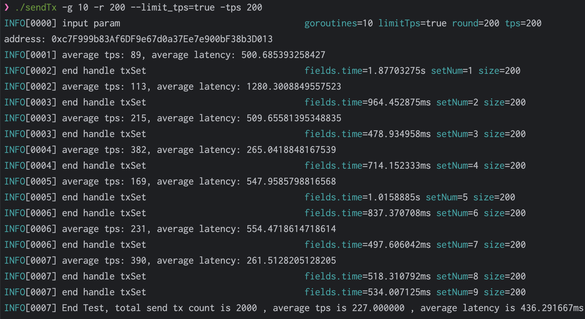

# Get sign benchmark for axiom

test axiom handle transaction benchmark.

## Getting started

- you can **clone** the project by

``` shell
git clone git@github.com:Karenlrx/axiom-benchmark.git
```
- modify config
    - you should ensure start axiom correctly,
    - modify account private key and nodes' ip in config.toml
- compile project
``` shell
cd axiom-benchmark && go build -o sendTx *.go 
```

- run test:
``` shell
./sendTx -g 10 -r 200 --limit_tps=true -tps 200
```
    you can get the help of command:
``` shell
Usage of ./getSign:
  -g int
        The number of concurrent go routines to send transaction to axiom (default 200)
  -limit_tps
        limit send transaction tps for client
  -r int
        The round of concurrent go routines to send transaction from axiom (default 10000)
  -tps int
        average send transaction tps for client (default 500)

```

## For example
